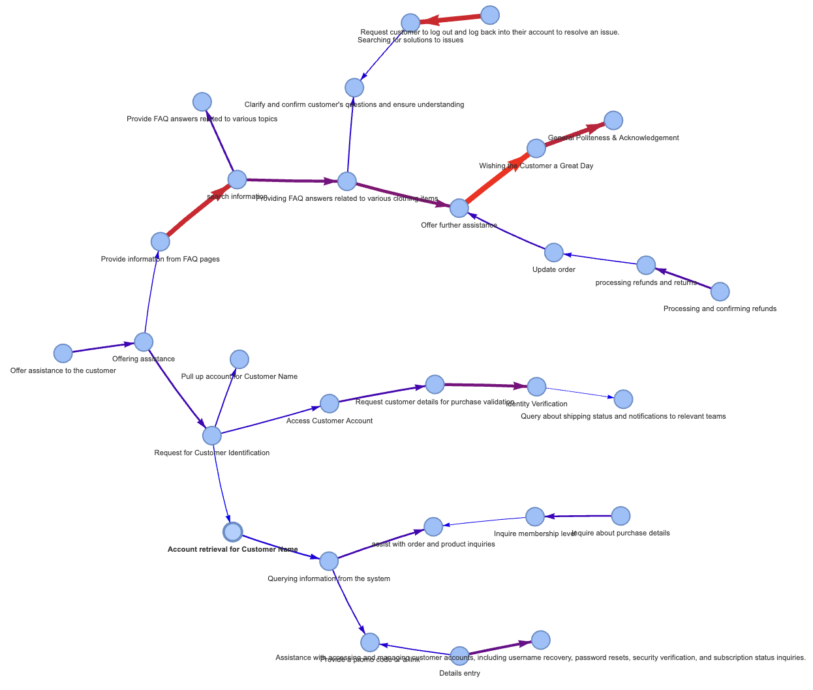

# Quasi-patterned Conversations Analysis

## Overview

This repository supports the research paper titled "[A Computational Approach to Modeling Conversational Systems: Analyzing Large-Scale Quasi-Patterned Dialogue Flows](AnalyzingLarge_ScaleQuasi_PatternedDialogueFlows.pdf)." The project introduces a novel computational framework for constructing conversational graphs that effectively capture the flow and patterns within quasi-patterned sets of conversations. By leveraging advanced embedding techniques, clustering, and large language models, this approach aims to enhance the analysis and visualization of conversational dynamics, particularly in large-scale dialogue datasets.

### Conversational Graph Visualization

Below is a view of the generated conversational graph using the Filter\&Reconnect method:



For a detailed explanation of the approach, please refer to the full research paper: [A Computational Approach to Modeling Conversational Systems: Analyzing Large-Scale Quasi-Patterned Dialogue Flows](AnalyzingLarge_ScaleQuasi_PatternedDialogueFlows.pdf).

## Methodology

The proposed methodology for constructing conversational graphs involves the following key steps:

1. **Utterance Embedding**: Embedding each utterance using a Sentence Transformer model (e.g., all-MiniLM-L12-v2).
2. **Clustering**: Applying K-means++ clustering to group similar utterances, using the elbow method to determine the optimal number of clusters.
3. **Outlier Removal**: Identifying and removing outliers based on their distances from cluster centroids.
4. **Intent Extraction**: Extracting intents from clustered utterances using large language models (LLMs).
5. **Transition Matrix Construction**: Building a transition matrix to analyze the flow between different conversational intents.
6. **Conversational Graph Construction**: Creating directed graphs that represent conversational flows using various graph simplification techniques, including the novel Filter\&Reconnect method.

These steps are designed to provide a scalable and interpretable solution for analyzing complex conversational datasets, with practical implications for improving automated conversational systems.

## Data Source

The study uses data from the [ABCD v1.1](https://github.com/asappresearch/abcd/blob/master/data/abcd_v1.1.json.gz) dataset, which contains customer support conversations. This dataset is ideal for this research as it exhibits quasi-patterned conversational flows, which are central to the proposed analysis.

### Using Custom Datasets

If you'd like to use this framework on other conversational datasets, ensure the data directory contains a JSON file where:

- Keys are conversation IDs.
- Values are a list of dictionaries, where each dictionary represents an utterance.
- Each dictionary should contain:
  - `role`: The role of the speaker (`"agent"`, `"customer"`, or `"action"`).
  - `content`: The content of the utterance.

Example structure:

```json
{
  "conversation_1": [
    {"role": "agent", "content": "Hello, how can I help you today?"},
    {"role": "customer", "content": "I need assistance with my account."},
    {"role": "action", "content": "Agent opened account details."},
    {"role": "agent", "content": "I can help with that. What seems to be the issue?"}
  ],
  "conversation_2": [
    {"role": "customer", "content": "My internet connection is down."},
    {"role": "agent", "content": "Let me check the status of your connection."},
    {"role": "action", "content": "Agent checked network status."},
    {"role": "agent", "content": "It seems like there’s an outage in your area."}
  ]
}
```

Ensure this file is placed in the `data/` directory under the name `processed_formatted_conversations.json`.

## Installation

1. Clone the repository:
    ```sh
    git clone https://github.com/achrefbenammar404/quasi-patterned-conversations-analysis.git
    ```
2. Navigate to the project directory:
    ```sh
    cd quasi-patterned-conversations-analysis
    ```
3. Create and activate a virtual environment:
    ```sh
    python3 -m venv venv
    source venv/bin/activate   # For MacOS/Linux
    .\venv\Scripts\activate    # For Windows
    ```
4. Install the required dependencies:
    ```sh
    pip install -r requirements.txt
    ```

## Usage

1. Ensure the conversation data is placed in the `data/` directory with the expected filename (`processed_formatted_conversations.json`).
   
2. Run the analysis using the command line with appropriate arguments:

    ```sh
    python main.py --num_sampled_data <NUMBER_OF_SAMPLES> --max_clusters <MAX_CLUSTERS> --percentile <PERCENTILE> --model_name <MODEL_NAME> --label_model <LABEL_MODEL> --min_weight <MIN_WEIGHT> --top_k <TOP_K_EDGES> --n_closest <N_CLOSEST_UTTERANCES>
    ```

   Example:
   
    ```sh
    python main.py --num_sampled_data 10 --max_clusters 5 --percentile 75 --model_name 'sentence-transformers/all-MiniLM-L12-v2' --label_model 'open-mixtral-8x22b' --min_weight 0.1 --top_k 1 --n_closest 1
    ```

3. Follow the on-screen prompts to select the optimal number of clusters based on the elbow method.

## Configuration Options

- `--num_sampled_data`: Number of sampled data points to process (default: 10).
- `--max_clusters`: Maximum number of clusters for the elbow method (default: 3).
- `--percentile`: Percentile for outlier removal (default: 75).
- `--model_name`: Sentence Transformer model for embedding (default: 'sentence-transformers/all-MiniLM-L12-v2').
- `--label_model`: Model for labeling clusters by closest utterance (default: 'open-mixtral-8x22b').
- `--min_weight`: Minimum weight threshold for edges in the conversational graph (default: 0.1).
- `--top_k`: Number of top edges to keep in the conversational graph (default: 1).
- `--n_closest`: Number of closest utterances per cluster centroid for intent extraction (default: 1).

## Results and Analysis

The results include visualizations of t-SNE clusters, histograms of distance distributions, and HTML files for visualizing conversational flows using different graph simplification techniques (Threshold Filtering, Top-K Filtering, and Filter\&Reconnect). The Filter\&Reconnect method provides the most readable and interpretable graphs, effectively highlighting key conversational patterns.

## Acknowledgements

- Uses data from [ABCD v1.1](https://github.com/asappresearch/abcd/blob/master/data/abcd_v1.1.json.gz).
- The methodologies incorporate advancements in sentence embedding and graph construction techniques.
